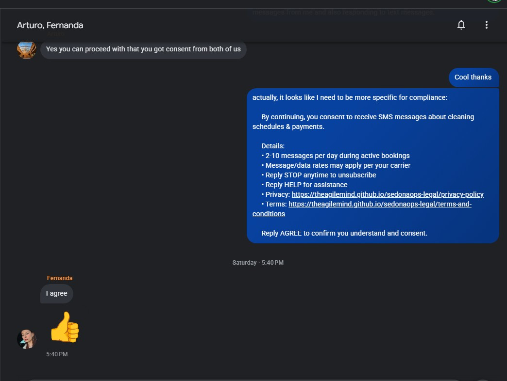

# SMS Consent Documentation

**Date:** February 7, 2026  
**Purpose:** A2P 10DLC Campaign Registration Compliance  
**Platform:** SedonaOps.ai / Project Sedona PMS

---

## Contractor SMS Consent Verification

### Consent Request Message Sent

**Date:** Saturday, February 7, 2026 at 5:40 PM MST  
**Recipients:** Arturo (Team Lead), Fernanda (Primary Cleaner)  
**Channel:** Group SMS (Google Messages)

**Full Disclosure Text Sent:**

> By continuing, you consent to receive SMS messages about cleaning schedules & payments.
>
> **Details:**
> - 2-10 messages per day during active bookings
> - Message/data rates may apply per your carrier
> - Reply STOP anytime to unsubscribe
> - Reply HELP for assistance
> - Privacy: https://theagilemind.github.io/sedonaops-legal/privacy-policy
> - Terms: https://theagilemind.github.io/sedonaops-legal/terms-and-conditions
>
> Reply AGREE to confirm you understand and consent.

---

### Consent Responses Received

**Fernanda (Primary Cleaner)**  
- **Time:** Saturday 5:40 PM (same minute)  
- **Response:** "I agree" + 👍 (thumbs up emoji)  
- **Status:** ✅ **Consent Confirmed**

**Arturo (Team Lead)**  
- **Time:** Prior to Fernanda's response  
- **Response:** "Yes you can proceed with that you got consent from both of us"  
- **Status:** ✅ **Consent Confirmed (on behalf of team)**

---

### Consent Elements Present

| Required Element | Present in Request | Notes |
|------------------|-------------------|-------|
| Message Frequency | ✅ 2-10 messages per day | Explicitly stated |
| Cost Disclosure | ✅ "Message/data rates may apply" | Per carrier |
| Opt-Out Instructions | ✅ "Reply STOP anytime to unsubscribe" | Clear and simple |
| Help Instructions | ✅ "Reply HELP for assistance" | Support path provided |
| Privacy Policy | ✅ Full URL provided | https://theagilemind.github.io/sedonaops-legal/privacy-policy |
| Terms & Conditions | ✅ Full URL provided | https://theagilemind.github.io/sedonaops-legal/terms-and-conditions |
| Explicit Consent | ✅ "Reply AGREE to confirm" | Active confirmation required |

---

## Standard Contractor Opt-In Process

For full details on how all contractors (new and existing) consent to receive SMS notifications, see the [SedonaOps SMS Consent Form](sms-consent-form).

Two verified opt-in methods are supported:
1. **Contractor Services Agreement** -- New staff sign a written agreement with a dedicated SMS Consent section before any messages are sent.
2. **SMS Keyword Opt-In** -- Existing staff text START (or EMPEZAR) and receive full disclosure before enrollment.

**No opt-in methods used:**
- Verbal consent without written record
- Paper-only forms without digital backup
- Imported or purchased contact lists
- Social media opt-ins
- Website chat widgets

---

## Verification Screenshot

*Screenshot shows the full SMS conversation with consent request and affirmative responses from both team members.*

---

## Contact Information

**Business:** SedonaOps.ai / Project Sedona PMS  
**Owner:** David Marshall  
**Phone:** +1-928-531-5570  
**Email:** support@sedonaops.ai  
**Website:** https://sedonaops.ai

---

*This documentation is provided for The Campaign Registry (TCR) A2P 10DLC compliance verification.*
